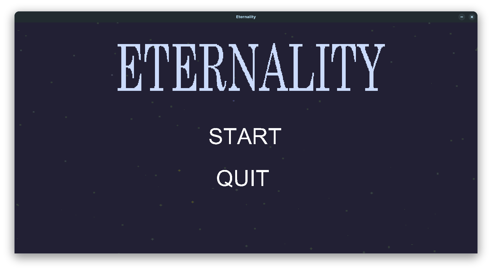
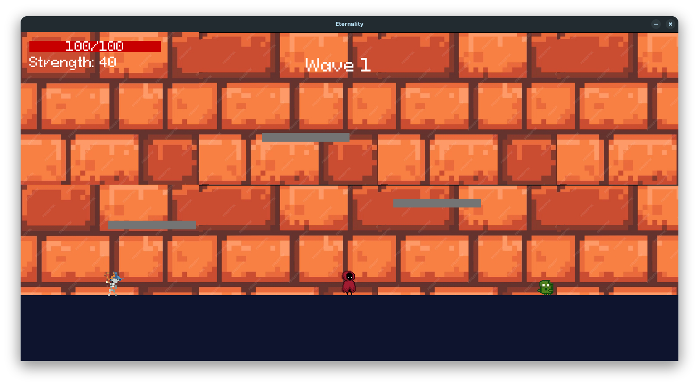
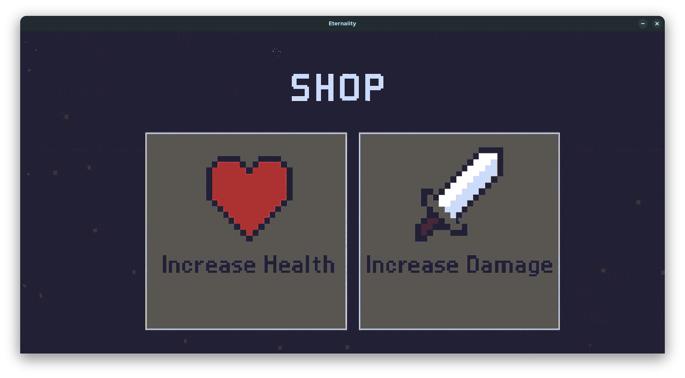

# Eternality

A wave-based survival action game built with Python and Pygame — fight off increasingly difficult waves of enemies for as long as you can.

  

🎮 **[Play on itch.io](YOUR_ITCH_LINK_HERE)**

## About

Eternality is a 2D side-view survival game where you face escalating waves of enemies — zombies, skeleton sentries, wizards, ghosts, and more — each with their own attack patterns and behaviors. Survive as long as you can, land hits, and upgrade between waves to push further.

## Features

- Wave-based enemy spawning system that scales difficulty over time
- Multiple enemy types with distinct movement, attacks, and animations (melee zombies, ranged sentries, projectile-throwing wizards, ghosts, and more)
- Animated combat, movement, and jumping
- Shop/upgrade system between waves (boost health or strength)
- Background music and sound effects
- Player stats tracking (damage dealt, damage taken, waves completed)

## Controls

| Key | Action |
|-----|--------|
| W / A / S / D | Move |
| Space | Jump |
| H | Attack |

## Built With

- [Python](https://www.python.org/)
- [Pygame](https://www.pygame.org/)
- [PyInstaller](https://pyinstaller.org/) — for packaging into a standalone Windows executable

## Download & Play

- 🎮 **[Play on itch.io](YOUR_ITCH_LINK_HERE)** — download the Windows build, no setup needed
- Or grab the `.exe` directly from [Releases](../../releases)

## What I Learned

Building the wave/enemy spawning system was the most interesting technical challenge — managing timed spawns, scaling difficulty across waves, and keeping multiple enemy types (each with their own animation states, attack cooldowns, and projectiles) running smoothly together took a fair amount of iteration. I also learned how to package a Pygame project into a standalone Windows `.exe` using PyInstaller and Wine on Linux, including correctly bundling assets with `sys._MEIPASS` so paths resolve properly outside the source environment.

## Credits

Some visual and audio assets used in this project were sourced from free online packs (including itch.io) and are not original work. Original music was composed by my friends.

## License

The source code in this repository is licensed under the MIT License (see [LICENSE](LICENSE)).

Note: Some visual and audio assets used in this project were sourced from the internet (including free itch.io asset packs) and are not covered by this license. These assets remain the property of their original creators. If you plan to reuse this project, please replace third-party assets with your own or properly licensed alternatives.
